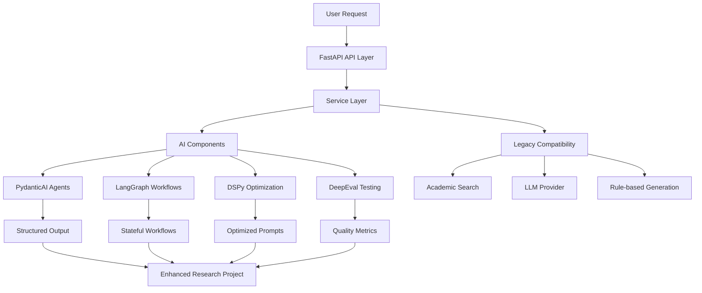

# AI Research Project Generator

[](https://github.com/depatter/ai-research-project-generator/actions/workflows/ci.yml)
[](https://github.com/depatter/ai-research-project-generator/actions/workflows/security.yml)
[](https://www.python.org/downloads/)
[](https://opensource.org/licenses/MIT)
[](https://github.com/astral-sh/ruff)

A comprehensive solution for generating robust research projects using AI. This tool combines **local LLM integration**, **academic search APIs**, and **rule-based project generation** to provide detailed and accurate subject analysis.

## 🚀 Features

### 🤖 Local LLM Integration (Ollama)
- **Multiple model support**: Llama 3.1, Qwen 2.5, Gemma 2, Phi-4, DeepSeek, and more
- **Research-specific prompts**: Topic analysis, methodology recommendations, literature synthesis
- **Streaming support**: Real-time response generation
- **No API costs**: Run entirely on your local machine

### 📚 Academic Search APIs
- **Semantic Scholar**: 200M+ papers with citation data
- **OpenAlex**: Free, comprehensive scholarly database
- **CrossRef**: DOI and metadata for 140M+ records
- **arXiv**: Preprints in physics, math, CS, and more

### 🔬 Research Methodologies
- Systematic Reviews (PRISMA 2020 compliant)
- Scoping Reviews
- Meta-Analyses
- Qualitative Studies
- Quantitative Studies
- Mixed Methods
- Case Studies
- Experimental Research

### ✅ Quality Validation
- PRISMA compliance checking
- Methodological rigor assessment
- Feasibility evaluation
- Quality scoring (0.00-1.00)

## 📋 Recommended Local Models

### Best Quality (24GB+ VRAM)
| Model | VRAM | Context | Notes |
|-------|------|---------|-------|
| `llama3.1:70b` | 48GB+ | 128K | Best quality, needs high-end GPU |
| `qwen2.5:32b` | 24GB+ | 128K | Excellent for research, Apache-2.0 |
| `mixtral:8x7b` | 24GB+ | 32K | MoE, good throughput |

### Balanced (8-16GB VRAM)
| Model | VRAM | Context | Notes |
|-------|------|---------|-------|
| `llama3.1:8b` | 8GB+ | 128K | Great balance of quality/speed |
| `qwen2.5:14b` | 12GB+ | 128K | Strong reasoning, Apache-2.0 |
| `gemma2:9b` | 8GB+ | 8K | Efficient, good quality |

### Lightweight (4-8GB VRAM / CPU)
| Model | VRAM | Context | Notes |
|-------|------|---------|-------|
| `llama3.2:3b` | 4GB+ | 128K | Small but capable |
| `phi4:3.8b` | 4GB+ | 128K | Excellent reasoning for size |
| `qwen2.5:7b` | 6GB+ | 128K | Good for laptops |

### Reasoning-Focused
| Model | VRAM | Context | Notes |
|-------|------|---------|-------|
| `deepseek-r1:7b` | 8GB+ | 64K | Strong reasoning/math |
| `phi4-reasoning:14b` | 12GB+ | 32K | Chain-of-thought |

## 🛠️ Installation

### 1. Install Ollama (for local LLM)

```bash
# macOS
brew install ollama

# Linux
curl -fsSL https://ollama.ai/install.sh | sh

# Windows
# Download from https://ollama.ai
```

### 2. Pull a model

```bash
# Recommended for most users (8GB+ VRAM)
ollama pull llama3.1:8b

# For laptops/limited hardware
ollama pull phi4:3.8b

# For best quality (24GB+ VRAM)
ollama pull qwen2.5:32b
```

### 3. Install the project

```bash
git clone <repository-url>
cd ai-research-project-generator

# Using uv (recommended)
uv sync

# Or using pip
pip install -e .
```

## 🚀 Usage

### Command Line Interface

```bash
# Basic usage with local LLM
uv run python research_engine.py

# Generate a specific project
uv run python main.py \
    --topic "Impact of remote work on employee productivity" \
    --question "How has remote work affected productivity and well-being?" \
    --type systematic_review \
    --level graduate \
    --discipline psychology \
    --format markdown \
    --output my_project.md
```

### Python API

```python
from research_engine import AIResearchEngine
from llm_provider import LLMConfig, LLMProvider

# Initialize with local LLM
engine = AIResearchEngine(
    llm_config=LLMConfig(
        provider=LLMProvider.OLLAMA,
        model="llama3.1:8b",
        base_url="http://localhost:11434"
    ),
    use_llm=True,
    use_academic_search=True
)

# Generate enhanced research project
project = engine.generate_enhanced_project(
    topic="Impact of remote work on employee productivity",
    research_question="How has remote work affected productivity and well-being?",
    research_type="systematic_review",
    academic_level="graduate",
    discipline="psychology",
    search_papers=True,
    paper_limit=20,
    year_range=(2020, 2025)
)

# Export to markdown
output = engine.export_enhanced_project(project, "markdown")
print(output)

engine.close()
```

### Search Academic Papers Only

```python
from academic_search import UnifiedAcademicSearch

search = UnifiedAcademicSearch(
    openalex_email="your@email.com"  # Optional, for polite pool
)

# Search across all sources
results = search.search_all(
    query="remote work productivity",
    limit_per_source=10,
    year_range=(2020, 2025)
)

# Get merged, deduplicated results
papers = search.search_merged(
    query="remote work productivity",
    limit=20,
    year_range=(2020, 2025)
)

for paper in papers[:5]:
    print(f"{paper.title} ({paper.year}) - {paper.citation_count} citations")
    print(f"  {paper.to_citation('APA')}")

search.close()
```

### Use LLM Directly

```python
from llm_provider import ResearchLLMAssistant, LLMConfig, LLMProvider

assistant = ResearchLLMAssistant(
    LLMConfig(
        provider=LLMProvider.OLLAMA,
        model="llama3.1:8b"
    )
)

# Analyze a topic
result = assistant.analyze_topic(
    "machine learning in healthcare",
    "computer science"
)
print(result["analysis"])

# Generate research questions
questions = assistant.generate_research_questions(
    "AI in medical diagnosis",
    "systematic_review",
    "What is the effectiveness of AI in medical diagnosis?"
)
for q in questions:
    print(f"- {q}")

assistant.close()
```

## 🏗️ Architecture

The AI Research Project Generator follows a **modern, layered architecture** with comprehensive AI enablement:



### Key Architectural Patterns

| Pattern | Implementation | Purpose |
|---------|----------------|---------|
| **Strategy Pattern** | LLM Provider abstraction | Multiple LLM backends |
| **Factory Pattern** | Service creation | Dependency injection |
| **Facade Pattern** | Unified search interface | API consolidation |
| **Graph Pattern** | LangGraph workflows | Stateful orchestration |
| **Agent Pattern** | PydanticAI agents | Type-safe LLM output |

### Package Structure

```
ai-research-project-generator/
├── src/ai_research_generator/          # Main package (src layout)
│   ├── api/                           # FastAPI routes
│   │   ├── routes.py              # REST API endpoints
│   │   └── main.py               # FastAPI app entry
│   ├── core/                          # Core functionality
│   │   ├── config.py              # Pydantic Settings
│   │   ├── exceptions.py          # Custom exceptions
│   │   └── retry.py               # Retry logic
│   ├── services/                      # Business logic
│   │   └── research_service.py     # Main service layer
│   ├── models/                        # Pydantic schemas
│   │   └── research.py             # Request/response models
│   ├── agents/                       # PydanticAI agents
│   │   └── research_agents.py      # Type-safe agents
│   ├── workflows/                    # LangGraph workflows
│   │   └── research_workflow.py     # Stateful workflows
│   ├── optimization/                  # DSPy optimization
│   │   └── dspy_modules.py          # Optimized modules
│   └── legacy/                        # Legacy compatibility
│       ├── academic_search.py     # Academic search APIs
│       ├── llm_provider.py        # LLM integration
│       ├── research_engine.py     # Legacy engine
│       └── ...                   # Other legacy modules
├── tests/                             # Test suite
├── docs/                             # Documentation
├── scripts/                          # CLI and utilities
└── examples/                         # Usage examples
```

### AI Integration Status

| Component | Framework | Status | Integration |
|------------|-----------|---------|------------|
| **PydanticAI** | ✅ Active | Integrated in API routes |
| **LangGraph** | ✅ Active | Used for complex workflows |
| **DSPy** | ✅ Active | Offline optimization |
| **DeepEval** | ✅ Active | Quality testing |
| **FastAPI** | ✅ Active | REST API layer |
| **Legacy Code** | ✅ Maintained | Backward compatibility |

### Components

| Module | Description |
|--------|-------------|
| **FastAPI App** | Modern REST API with AI integration |
| **Research Service** | Business logic and orchestration |
| **PydanticAI Agents** | Type-safe LLM agents |
| **LangGraph Workflows** | Stateful workflow orchestration |
| **DSPy Optimization** | Offline prompt optimization |
| **Legacy Modules** | Backward compatibility layer |

### New AI Features

- **🤖 Type-Safe Agents**: PydanticAI ensures structured, validated LLM output
- **🔄 Stateful Workflows**: LangGraph enables complex, resumable workflows
- **⚡ Prompt Optimization**: DSPy provides eval-driven optimization
- **📊 Quality Testing**: DeepEval for comprehensive LLM evaluation
- **🔧 Configuration**: Unified settings management

## ⚙️ Configuration

### Environment Variables

```bash
# LLM Configuration
export LLM_PROVIDER=ollama           # ollama, openai, local_openai_compatible
export LLM_MODEL=llama3.1:8b         # Model name
export LLM_BASE_URL=http://localhost:11434  # Ollama server URL
export LLM_TEMPERATURE=0.7           # Generation temperature
export LLM_MAX_TOKENS=4096           # Max tokens per response

# API Keys (optional, for higher rate limits)
export SEMANTIC_SCHOLAR_API_KEY=your_key
export OPENALEX_EMAIL=your@email.com
export CROSSREF_EMAIL=your@email.com
```

### Using Different LLM Providers

```python
from llm_provider import LLMConfig, LLMProvider

# Ollama (local)
config = LLMConfig(
    provider=LLMProvider.OLLAMA,
    model="llama3.1:8b",
    base_url="http://localhost:11434"
)

# OpenAI
config = LLMConfig(
    provider=LLMProvider.OPENAI,
    model="gpt-4o",
    api_key="sk-..."
)

# Local OpenAI-compatible (LM Studio, vLLM, etc.)
config = LLMConfig(
    provider=LLMProvider.LOCAL_OPENAI_COMPATIBLE,
    model="local-model",
    base_url="http://localhost:8080/v1"
)
```

## 📊 Output Example

The enhanced research project includes:

### 🤖 AI-Enhanced Features
- **Structured Topic Analysis**: Type-safe analysis with PydanticAI validation
- **Stateful Workflows**: Complex multi-stage research generation with LangGraph
- **Optimized Prompts**: DSPy-optimized prompts for better performance
- **Quality Metrics**: DeepEval-based evaluation and testing

### 📚 Traditional Features
- **📚 Discovered Papers**: Real papers from academic databases
- **📋 Project Structure**: Complete research project framework
- **✅ Validation Report**: Quality assessment and recommendations

### 🚀 New API Capabilities

```python
# FastAPI endpoint with AI integration
POST /api/v1/research/generate
{
    "topic": "Machine learning in healthcare",
    "research_question": "How effective is ML in medical diagnosis?",
    "use_ai_workflow": true,
    "optimization_level": "medium"
}

# Response includes AI-enhanced analysis
{
    "project": "...",
    "ai_analysis": {
        "key_concepts": ["machine learning", "healthcare", "diagnosis"],
        "complexity": "advanced",
        "confidence": 0.92
    },
    "workflow_id": "research_workflow_12345"
}
```

## 🔧 Installation

### 1. Install Ollama (for local LLM)

```bash
# macOS
brew install ollama

# Linux
curl -fsSL https://ollama.ai/install.sh | sh

# Windows
# Download from https://ollama.ai
```

### 2. Pull a model

```bash
# Recommended for most users (8GB+ VRAM)
ollama pull llama3.1:8b

# For laptops/limited hardware
ollama pull phi4:3.8b

# For best quality (24GB+ VRAM)
ollama pull qwen2.5:32b
```

### 3. Install the project

```bash
git clone <repository-url>
cd ai-research-project-generator

# Using uv (recommended)
uv sync

# Or using pip
pip install -e .
```

### 4. Start the API server

```bash
# Start FastAPI server
uv run ai-research-api

# Or use legacy CLI
uv run research-generator --help
```

## 🔧 Troubleshooting

### Ollama not connecting
```bash
# Make sure Ollama is running
ollama serve

# Check if model is available
ollama list

# Pull model if needed
ollama pull llama3.1:8b
```

### Rate limiting on academic APIs
- Add your email to OpenAlex/CrossRef for polite pool access
- Get a Semantic Scholar API key for higher limits
- The system automatically handles rate limiting

### Out of memory
- Use a smaller model (phi4:3.8b, llama3.2:3b)
- Use quantized versions (Q4_K_M)
- Reduce max_tokens in config

## 📄 License

MIT License

## 🤝 Contributing

Contributions welcome! Please open an issue or PR.

## 📚 Citation

```bibtex
@software{ai_research_generator,
  title = {AI Research Project Generator},
  year = {2025},
  url = {https://github.com/your-repo/ai-research-project-generator}
}
```
