# Architecture & Design Decisions

## Overview

The AI Research Project Generator follows a **modern, layered architecture** with comprehensive AI enablement and proper separation of concerns. The system combines multiple AI frameworks to provide intelligent research project generation while maintaining backward compatibility.

## Architecture Overview


## LangGraph Multi-Stage Research Workflow

The following diagram shows the complete LangGraph workflow with PydanticAI agents and research tools:

```mermaid
flowchart TB
    subgraph Input["📥 Input"]
        REQ[Research Request]
        REQ --> |topic, question, config| START
    end

    subgraph LangGraph["🔄 LangGraph StateGraph"]
        START((START)) --> DISCOVERY
        
        subgraph Stage1["Stage 1: Discovery"]
            DISCOVERY[🔍 Discovery Node]
            DISCOVERY --> |analyze topic| AGENT1
            subgraph PydanticAI1["PydanticAI Agent"]
                AGENT1[TopicAnalyzerAgent]
                AGENT1 --> |TopicAnalysis| CONCEPTS
            end
            CONCEPTS[Extract Key Concepts]
            CONCEPTS --> STRATEGY[Create Search Strategy]
        end
        
        STRATEGY --> COLLECTION
        
        subgraph Stage2["Stage 2: Collection"]
            COLLECTION[📚 Collection Node]
            COLLECTION --> |parallel| TOOLS
            subgraph Tools["Research Tools"]
                direction LR
                TOOL1[🔬 AcademicSearchTool]
                TOOL2[📖 GoogleScholarTool]
                TOOL3[🌐 WebSearchTool]
            end
            TOOLS --> AGGREGATE[Aggregate & Deduplicate]
        end
        
        AGGREGATE --> ANALYSIS
        
        subgraph Stage3["Stage 3: Analysis"]
            ANALYSIS[🧪 Analysis Node]
            ANALYSIS --> |sources| AGENT2
            subgraph PydanticAI2["PydanticAI Agent"]
                AGENT2[PaperAnalyzerAgent]
                AGENT2 --> |PaperSynthesis| THEMES
            end
            THEMES[Theme Extraction]
            THEMES --> METHODOLOGY[Methodology Analysis]
        end
        
        METHODOLOGY --> VERIFY_CHECK{Verification Enabled?}
        VERIFY_CHECK --> |Yes| VERIFICATION
        VERIFY_CHECK --> |No| SYNTHESIS
        
        subgraph Stage4["Stage 4: Verification"]
            VERIFICATION[✅ Verification Node]
            VERIFICATION --> FACT_TOOL
            subgraph FactCheck["Fact Verification"]
                FACT_TOOL[🔎 FactVerificationTool]
                FACT_TOOL --> CREDIBILITY[Source Credibility]
            end
        end
        
        CREDIBILITY --> SYNTHESIS
        
        subgraph Stage5["Stage 5: Synthesis"]
            SYNTHESIS[🧠 Synthesis Node]
            SYNTHESIS --> SYNTH_TOOL
            subgraph SynthTools["Synthesis Tools"]
                SYNTH_TOOL[💡 KnowledgeSynthesisTool]
                SYNTH_TOOL --> |LLM| GAPS[Identify Gaps]
            end
            GAPS --> RECOMMEND[Generate Recommendations]
        end
        
        RECOMMEND --> REPORT
        
        subgraph Stage6["Stage 6: Report"]
            REPORT[📝 Report Node]
            REPORT --> CITE_MGR
            subgraph Citation["Citation Management"]
                CITE_MGR[📚 CitationManager]
                CITE_MGR --> |APA/MLA/BibTeX| BIBLIOGRAPHY
            end
            BIBLIOGRAPHY[Format Bibliography]
            BIBLIOGRAPHY --> EXEC_SUMMARY[Executive Summary]
            EXEC_SUMMARY --> DETAILED[Detailed Report]
        end
        
        DETAILED --> END_NODE((END))
    end

    subgraph Output["📤 Output"]
        END_NODE --> RESULT[ResearchReport]
        RESULT --> |JSON| API_RESP[API Response]
        RESULT --> |Markdown| MD_FILE[Markdown Export]
    end

    style START fill:#90EE90
    style END_NODE fill:#FFB6C1
    style DISCOVERY fill:#E6E6FA
    style COLLECTION fill:#E6E6FA
    style ANALYSIS fill:#E6E6FA
    style VERIFICATION fill:#E6E6FA
    style SYNTHESIS fill:#E6E6FA
    style REPORT fill:#E6E6FA
    style AGENT1 fill:#FFE4B5
    style AGENT2 fill:#FFE4B5
    style TOOL1 fill:#B0E0E6
    style TOOL2 fill:#B0E0E6
    style TOOL3 fill:#B0E0E6
    style FACT_TOOL fill:#B0E0E6
    style SYNTH_TOOL fill:#B0E0E6
    style CITE_MGR fill:#DDA0DD
```



## PydanticAI Agents Detail


## Research Tools Architecture


## Citation Management Flow


## Package Structure

```
ai-research-project-generator/
├── src/ai_research_generator/          # Main package (src layout)
│   ├── api/                           # FastAPI routes
│   │   ├── routes.py              # REST API endpoints
│   │   └── main.py               # FastAPI app entry
│   ├── core/                          # Core functionality
│   │   ├── config.py              # Pydantic Settings
│   │   ├── exceptions.py          # Custom exceptions
│   │   └── retry.py               # Retry logic
│   ├── services/                      # Business logic
│   │   └── research_service.py     # Main service layer
│   ├── models/                        # Pydantic schemas
│   │   └── research.py             # Request/response models
│   ├── agents/                       # PydanticAI agents
│   │   └── research_agents.py      # Type-safe agents
│   ├── workflows/                    # LangGraph workflows
│   │   ├── research_workflow.py     # Basic stateful workflows
│   │   ├── multi_stage_workflow.py  # Multi-stage research (NEW)
│   │   └── agents.py              # PydanticAI agent definitions
│   ├── tools/                        # Research Tools (NEW v2.2)
│   │   ├── research_tools.py      # Core research tools
│   │   ├── google_scholar.py      # Google Scholar integration
│   │   └── citation_manager.py    # Citation management
│   ├── optimization/                  # DSPy optimization
│   │   └── dspy_modules.py          # Optimized modules
│   └── legacy/                        # Legacy compatibility
│       ├── academic_search.py     # Academic search APIs
│       ├── llm_provider.py        # LLM integration
│       ├── research_engine.py     # Legacy engine
│       └── ...                   # Other legacy modules
├── tests/                             # Test suite
├── docs/                             # Documentation
├── scripts/                          # CLI and utilities
└── examples/                         # Usage examples
```

## Core Design Patterns

### 1. **Strategy Pattern** (LLM Providers)

**Location**: `src/ai_research_generator/legacy/llm_provider.py`

**Implementation**:
```python
class BaseLLMClient(ABC):
    @abstractmethod
    def generate(self, prompt: str, system_prompt: Optional[str] = None) -> LLMResponse
    
class OllamaClient(BaseLLMClient):
    # Ollama-specific implementation
    
class OpenAICompatibleClient(BaseLLMClient):
    # OpenAI-compatible implementation
```

**Why**: 
- **Flexibility**: Easy to add new LLM providers (Anthropic, Gemini, local models)
- **Testability**: Can mock different providers for testing
- **Configuration**: Switch providers via environment variables without code changes

### 2. **Factory Pattern** (Service Creation)

**Location**: `src/ai_research_generator/legacy/llm_provider.py`, `src/ai_research_generator/legacy/academic_search.py`

**Implementation**:
```python
def create_llm_client(config: Optional[LLMConfig] = None) -> BaseLLMClient:
    if config.provider == LLMProvider.OLLAMA:
        return OllamaClient(config)
    elif config.provider == LLMProvider.OPENAI:
        return OpenAICompatibleClient(config)
```

**Why**:
- **Encapsulation**: Hides complex initialization logic
- **Single Responsibility**: Client creation logic in one place
- **Easy Testing**: Can inject mock configs

### 3. **Facade Pattern** (Unified Search Interface)

**Location**: `src/ai_research_generator/legacy/academic_search.py`

**Implementation**:
```python
class UnifiedAcademicSearch:
    def search_all(self, query: str, limit_per_source: int) -> List[Paper]:
        # Unified interface to multiple search APIs
        pass
```

**Why**:
- **Simplicity**: Single interface for multiple search APIs
- **Extensibility**: Easy to add new search sources
- **Consistency**: Uniform data structures

### 4. **Agent Pattern** (PydanticAI)

**Location**: `src/ai_research_generator/agents/research_agents.py`

**Implementation**:
```python
class TopicAnalyzerAgent(Agent):
    def __init__(self, model: str, base_url: str):
        super().__init__(
            model=f"gateway/{model}",
            system_prompt="Analyze research topics..."
        )
    
    def run(self, topic: str, discipline: str) -> TopicAnalysis:
        return self.run(topic, discipline=discipline)
```

**Why**:
- **Type Safety**: Pydantic validation ensures structured output
- **Developer Experience**: FastAPI-like patterns
- **Error Handling**: Built-in validation and error handling

### 5. **Graph Pattern** (LangGraph)

**Location**: `src/ai_research_generator/workflows/research_workflow.py`

**Implementation**:
```python
class ResearchState(TypedDict):
    topic: str
    analysis: dict
    literature: list[str]

def create_research_graph() -> StateGraph:
    workflow = StateGraph(ResearchState)
    workflow.add_node("analyze_topic", analyze_topic)
    workflow.add_node("search_papers", search_papers)
    workflow.add_edge("analyze_topic", "search_papers")
    return workflow.compile()
```

**Why**:
- **State Management**: Shared state across workflow nodes
- **Checkpointing**: Save/restore workflow state
- **Scalability**: Complex multi-agent orchestration

## AI Components Integration

### PydanticAI Integration

- **Location**: `src/ai_research_generator/agents/`
- **Purpose**: Type-safe LLM output with validation
- **Benefits**: FastAPI-like DX, automatic validation
- **Usage**: Structured output for research analysis

### LangGraph Integration

- **Location**: `src/ai_research_generator/workflows/`
- **Purpose**: Stateful workflow orchestration
- **Benefits**: Checkpointing, error recovery, parallel processing
- **Usage**: Complete research generation workflows

### Multi-Stage Workflow (v2.2)

- **Location**: `src/ai_research_generator/workflows/multi_stage_workflow.py`
- **Purpose**: Advanced 6-stage research workflow
- **Stages**:
  1. **Discovery**: Topic analysis, scope definition, search strategy
  2. **Collection**: Parallel multi-source data gathering
  3. **Analysis**: Theme extraction, methodology analysis
  4. **Verification**: Fact checking, source credibility (optional)
  5. **Synthesis**: Knowledge integration, gap identification
  6. **Report**: Comprehensive report with citations
- **Benefits**: Configurable stages, progress tracking, quality metrics

### Research Tools (v2.2)

- **Location**: `src/ai_research_generator/tools/`
- **Purpose**: LangGraph-compatible research tools
- **Tools**:
  - `WebSearchTool`: Web search via Serper, Tavily, DuckDuckGo
  - `AcademicSearchTool`: Multi-database academic search
  - `GoogleScholarTool`: Google Scholar integration
  - `KnowledgeSynthesisTool`: LLM-powered synthesis
  - `FactVerificationTool`: Claim verification
  - `ResearchToolkit`: Unified interface
- **Pattern**: `@tool` decorators for LangGraph compatibility

### Citation Management (v2.2)

- **Location**: `src/ai_research_generator/tools/citation_manager.py`
- **Purpose**: Academic citation formatting and management
- **Styles**: BibTeX, APA, APA7, MLA, MLA9, Chicago, IEEE, Harvard, Vancouver
- **Features**: In-text citations, bibliography export, citation key generation

### DSPy Integration

- **Location**: `src/ai_research_generator/optimization/`
- **Purpose**: Eval-driven prompt optimization
- **Benefits**: Performance optimization, model-agnostic
- **Usage**: Offline prompt optimization

### DeepEval Integration

- **Location**: `tests/test_evaluation.py`
- **Purpose**: LLM output evaluation
- **Benefits**: Quality metrics, regression testing
- **Usage**: Comprehensive AI component testing

## Migration Strategy

### Legacy → Modern

1. **Phase 1**: Maintain legacy interfaces
2. **Phase 2**: Add new AI components
3. **Phase 3**: Integrate AI into main API
4. **Phase 4**: Deprecate legacy interfaces

### Backward Compatibility

- Legacy modules available in `src/ai_research_generator/legacy/`
- Import aliases in main package
- Configuration supports both approaches
- Gradual migration path

## Core Design Patterns

### 1. **Strategy Pattern** (LLM Providers)

**Location**: `llm_provider.py`

**Implementation**:
```python
class BaseLLMClient(ABC):
    @abstractmethod
    def generate(self, prompt: str, system_prompt: Optional[str] = None) -> LLMResponse
    
class OllamaClient(BaseLLMClient):
    # Ollama-specific implementation
    
class OpenAICompatibleClient(BaseLLMClient):
    # OpenAI-compatible implementation
```

**Why**: 
- **Flexibility**: Easy to add new LLM providers (Anthropic, Gemini, local models)
- **Testability**: Can mock different providers for testing
- **Configuration**: Switch providers via environment variables without code changes

**Alternatives Considered**:
- **Single monolithic client**: Would require if/else chains for each provider
- **Separate modules per provider**: Would duplicate common HTTP logic
- **Factory pattern only**: Strategy provides better runtime flexibility

---

### 2. **Factory Pattern** (Client Creation)

**Location**: `llm_provider.py`, `academic_search.py`

**Implementation**:
```python
def create_llm_client(config: Optional[LLMConfig] = None) -> BaseLLMClient:
    if config.provider == LLMProvider.OLLAMA:
        return OllamaClient(config)
    elif config.provider == LLMProvider.OPENAI:
        return OpenAICompatibleClient(config)
```

**Why**:
- **Encapsulation**: Hides complex initialization logic
- **Single Responsibility**: Client creation logic in one place
- **Easy Testing**: Can inject mock configs

**Alternatives Considered**:
- **Direct instantiation**: Less flexible, harder to test
- **Dependency injection framework**: Overkill for this project size

---

### 3. **Facade Pattern** (Unified Search Interface)

**Location**: `academic_search.py`

**Implementation**:
```python
class UnifiedAcademicSearch:
    def __init__(self):
        self.semantic_scholar = SemanticScholarSearch()
        self.openalex = OpenAlexSearch()
        self.crossref = CrossRefSearch()
        self.arxiv = ArxivSearch()
    
    def search_all(self, query: str) -> Dict[str, SearchResult]:
        # Coordinates searches across all sources
```

**Why**:
- **Simplicity**: Single interface for multiple complex APIs
- **Aggregation**: Combines results from 4+ sources seamlessly
- **Error Handling**: Centralizes retry logic and rate limiting

**Alternatives Considered**:
- **Individual search calls**: User would need to manage 4 different APIs
- **Adapter pattern**: More complex, unnecessary for this use case
- **Mediator pattern**: Overkill, no complex inter-service communication needed

---

### 4. **Dataclass Pattern** (Data Transfer Objects)

**Location**: All modules

**Implementation**:
```python
@dataclass
class Paper:
    title: str
    authors: List[str]
    abstract: Optional[str] = None
    year: Optional[int] = None
    # ... more fields
    
    def to_citation(self, style: str = "APA") -> str:
        # Business logic on data
```

**Why**:
- **Type Safety**: Automatic type checking with mypy
- **Immutability Options**: Can use `frozen=True` for immutable DTOs
- **Auto-generated Methods**: `__init__`, `__repr__`, `__eq__` for free
- **Serialization**: Easy conversion with `asdict()` for JSON export

**Alternatives Considered**:
- **Plain dictionaries**: No type safety, prone to typos
- **Pydantic models**: More features but heavier dependency
- **Named tuples**: Immutable but less flexible, no default values

---

### 5. **Composition Over Inheritance** (Research Engine)

**Location**: `research_engine.py`

**Implementation**:
```python
class AIResearchEngine:
    def __init__(self):
        self.project_generator = AIResearchProjectGenerator()
        self.subject_analyzer = SubjectAnalyzer()
        self.validation_engine = ValidationEngine()
        self.llm_assistant = ResearchLLMAssistant(config)
        self.academic_search = UnifiedAcademicSearch()
```

**Why**:
- **Flexibility**: Can swap implementations at runtime
- **Testability**: Easy to inject mocks for each component
- **Loose Coupling**: Components don't know about each other
- **Single Responsibility**: Each component has one job

**Alternatives Considered**:
- **Inheritance hierarchy**: Would create tight coupling, hard to test
- **Monolithic class**: Would violate SRP, become unmaintainable
- **Service locator**: Would hide dependencies, harder to test

---

### 6. **Builder Pattern** (Implicit in Config Classes)

**Location**: `llm_provider.py`

**Implementation**:
```python
@dataclass
class LLMConfig:
    provider: LLMProvider
    model: str
    base_url: str = "http://localhost:11434"
    # ... more fields
    
    @classmethod
    def from_env(cls) -> "LLMConfig":
        # Build config from environment
```

**Why**:
- **Flexibility**: Multiple ways to construct configs
- **Validation**: Can validate in `from_env()` method
- **Defaults**: Sensible defaults for common use cases

**Alternatives Considered**:
- **Constructor with many parameters**: Hard to use, error-prone
- **Fluent builder**: More code, not Pythonic
- **Config files**: Less flexible, requires file I/O

---

### 7. **Template Method Pattern** (Base Search Classes)

**Location**: `academic_search.py`

**Implementation**:
```python
class BaseAcademicSearch(ABC):
    def _rate_limit(self):
        # Common rate limiting logic
    
    @abstractmethod
    def search(self, query: str) -> SearchResult:
        # Subclasses implement specific search
```

**Why**:
- **Code Reuse**: Rate limiting, error handling shared
- **Consistency**: All searches follow same pattern
- **Extensibility**: Easy to add new search providers

**Alternatives Considered**:
- **Mixins**: More complex, harder to understand
- **Decorators**: Would duplicate code across classes
- **No abstraction**: Would duplicate rate limiting logic

---

### 8. **Dependency Injection Pattern** (FastAPI v2.0)

**Location**: `app/api/routes.py`, `app/services/research_service.py`

**Implementation**:
```python
from typing import Annotated
from fastapi import Depends

async def get_research_service(
    settings: Annotated[Settings, Depends(get_settings)]
) -> ResearchService:
    """Dependency injection for research service"""
    global _research_service
    if _research_service is None:
        _research_service = ResearchService(settings)
        await _research_service.startup()
    return _research_service

@router.post("/research")
async def generate_research_project(
    request: ResearchRequest,
    service: Annotated[ResearchService, Depends(get_research_service)],
) -> ResearchResponse:
    return await service.generate_project(request)
```

**Why**:
- **Testability**: Easy to inject mock services in tests
- **Lifecycle Management**: Service initialized once, reused across requests
- **Loose Coupling**: Routes don't know how services are created
- **FastAPI Native**: Uses framework's built-in DI system

**Alternatives Considered**:
- **Global singletons**: Harder to test, hidden dependencies
- **Manual instantiation**: Duplicated code, no lifecycle management
- **Third-party DI frameworks**: Overkill, FastAPI's system is sufficient

---

### 9. **Service Layer Pattern** (FastAPI v2.0)

**Location**: `app/services/research_service.py`

**Implementation**:
```python
class ResearchService:
    """Encapsulates all business logic for research generation"""
    
    def __init__(self, settings: Settings):
        self.settings = settings
        self._llm_assistant = None
        self._academic_search = None
        self._project_generator = AIResearchProjectGenerator()
        self._subject_analyzer = SubjectAnalyzer()
        self._validation_engine = ValidationEngine()
    
    async def startup(self) -> None:
        """Initialize resources on application startup"""
        await self._init_llm()
        self._init_academic_search()
    
    async def shutdown(self) -> None:
        """Cleanup resources on application shutdown"""
        if self._llm_assistant:
            self._llm_assistant.close()
    
    async def generate_project(self, request: ResearchRequest) -> ResearchResponse:
        """Main business logic orchestration"""
        # Step 1: Generate base project
        # Step 2: Analyze subject
        # Step 3: Validate
        # Step 4: Search papers
        # Step 5: Enhance with LLM
        return response
```

**Why**:
- **Separation of Concerns**: Business logic isolated from HTTP layer
- **Reusability**: Same service can be used by CLI, API, or other interfaces
- **Testability**: Can test business logic without HTTP
- **Transaction Boundaries**: Clear place for transaction management

**Alternatives Considered**:
- **Fat controllers**: Business logic in routes, harder to test
- **Anemic domain model**: Logic scattered across utilities
- **CQRS**: Overkill for current requirements

---

### 10. **Pydantic Schema Pattern** (FastAPI v2.0)

**Location**: `app/schemas/research.py`

**Implementation**:
```python
from pydantic import BaseModel, Field, field_validator

class ResearchRequest(BaseModel):
    """Request schema with validation"""
    topic: str = Field(
        ...,
        min_length=10,
        max_length=2000,
        description="The research topic"
    )
    research_type: ResearchType = Field(default=ResearchType.SYSTEMATIC_REVIEW)
    paper_limit: int = Field(default=20, ge=1, le=100)
    
    @field_validator("year_end")
    @classmethod
    def validate_year_range(cls, v, info):
        if v and info.data.get("year_start") and v < info.data["year_start"]:
            raise ValueError("year_end must be >= year_start")
        return v
    
    model_config = {
        "json_schema_extra": {"examples": [...]}
    }

class ResearchResponse(BaseModel):
    """Response schema with full typing"""
    request_id: str
    enhanced: bool
    ai_topic_analysis: Optional[str] = None
    discovered_papers: Optional[List[PaperSchema]] = None
    validation_report: ValidationReportSchema
```

**Why**:
- **Automatic Validation**: Invalid requests rejected with clear errors
- **Type Safety**: Full type hints for IDE support
- **Documentation**: Auto-generated OpenAPI schemas
- **Serialization**: Automatic JSON conversion

**Alternatives Considered**:
- **Dataclasses**: No validation, manual serialization
- **Marshmallow**: Separate library, more verbose
- **Manual validation**: Error-prone, inconsistent

---

### 11. **Application Factory Pattern** (FastAPI v2.0)

**Location**: `app/main.py`

**Implementation**:
```python
from contextlib import asynccontextmanager

@asynccontextmanager
async def lifespan(app: FastAPI):
    """Manage application lifecycle"""
    # Startup
    settings = get_settings()
    service = ResearchService(settings)
    await service.startup()
    yield
    # Shutdown
    await service.shutdown()

def create_app() -> FastAPI:
    """Application factory"""
    settings = get_settings()
    
    app = FastAPI(
        title=settings.app_name,
        version=settings.app_version,
        lifespan=lifespan,
    )
    
    app.add_middleware(CORSMiddleware, ...)
    app.include_router(router, prefix=settings.api_prefix)
    
    return app

app = create_app()
```

**Why**:
- **Testability**: Can create app instances with different configs
- **Lifecycle Management**: Clean startup/shutdown with async context manager
- **Configuration**: Settings injected at creation time
- **Modularity**: Easy to add middleware, routers, exception handlers

**Alternatives Considered**:
- **Global app instance**: Harder to test, no lifecycle management
- **on_startup/on_shutdown events**: Deprecated in favor of lifespan
- **Manual resource management**: Error-prone, resource leaks

---

## Architectural Layers

### Layer 1: Data Access (Bottom)
- `academic_search.py`: External API clients (Semantic Scholar, OpenAlex, CrossRef, arXiv)
- `llm_provider.py`: LLM API clients (Ollama, OpenAI-compatible)
- **Responsibility**: HTTP communication, API-specific logic, rate limiting

### Layer 2: Domain Logic (Middle)
- `ai_research_project_generator.py`: Rule-based project generation
- `subject_analyzer.py`: Subject analysis algorithms
- `validation_engine.py`: Quality validation rules
- **Responsibility**: Domain logic, data transformation

### Layer 3: Service Layer (v2.0)
- `app/services/research_service.py`: Business logic orchestration
- **Responsibility**: Workflow coordination, transaction boundaries, error handling

### Layer 4: API Layer (v2.0)
- `app/api/routes.py`: REST API endpoints
- `app/schemas/research.py`: Request/response validation
- **Responsibility**: HTTP handling, input validation, response formatting

### Layer 5: Application Layer (v2.0)
- `app/main.py`: FastAPI application factory
- `app/core/config.py`: Configuration management
- `app/core/exceptions.py`: Exception hierarchy
- **Responsibility**: Application lifecycle, middleware, CORS, error handlers

### Legacy Layer
- `main.py`: CLI interface (v1.0)
- `research_engine.py`: Direct integration (v1.0)
- **Responsibility**: Backward compatibility, CLI access

---

## Key Architectural Decisions

### 1. **HTTP Client: httpx vs requests**

**Choice**: `httpx`

**Why**:
- **Async Support**: Future-proof for async operations
- **HTTP/2**: Better performance with modern APIs
- **Streaming**: Native support for streaming responses
- **Type Hints**: Better type annotations

**Trade-offs**:
- Less mature than `requests`
- Smaller community

---

### 2. **No ORM / Database**

**Choice**: In-memory data structures

**Why**:
- **Simplicity**: No database setup required
- **Portability**: Works anywhere Python runs
- **Speed**: No I/O overhead for small datasets
- **Stateless**: Each run is independent

**When to Change**:
- If caching search results becomes important
- If tracking project history is needed
- If multi-user support is required

---

### 3. **Synchronous vs Async**

**Choice**: **Async-first in v2.0** (FastAPI), synchronous in core modules

**Why**:
- **FastAPI Requirement**: FastAPI is async-native, benefits from async handlers
- **Non-blocking I/O**: API can handle multiple requests while waiting for LLM
- **Future-proof**: Easy to add parallel academic searches

**Implementation**:
```python
# Service layer uses async for orchestration
async def generate_project(self, request: ResearchRequest) -> ResearchResponse:
    # Async wrapper around sync core modules
    base_project = self._generate_base_project(request)  # Sync
    papers = await self._search_papers(request)  # Could be async
    ai_content = await self._enhance_with_llm(request)  # Could be async
```

**Trade-offs**:
- Core modules remain synchronous for simplicity
- Async only at service/API layer where it matters

---

### 4. **Configuration: Pydantic Settings (v2.0)**

**Choice**: `pydantic-settings` with environment variables and `.env` file support

**Location**: `app/core/config.py`

**Implementation**:
```python
from pydantic_settings import BaseSettings, SettingsConfigDict
from functools import lru_cache

class Settings(BaseSettings):
    app_name: str = "AI Research Project Generator"
    app_version: str = "2.0.0"
    
    # LLM Configuration
    llm_provider: str = "ollama"
    llm_model: str = "llama3.1:8b"
    llm_base_url: str = "http://localhost:11434"
    llm_api_key: Optional[str] = None
    
    # Academic Search
    semantic_scholar_api_key: Optional[str] = None
    openalex_email: Optional[str] = None
    
    model_config = SettingsConfigDict(
        env_file=".env",
        env_file_encoding="utf-8",
        case_sensitive=False,
    )

@lru_cache
def get_settings() -> Settings:
    return Settings()
```

**Why**:
- **12-Factor App**: Environment variables for configuration
- **Type Safety**: Pydantic validates and converts types
- **Caching**: `@lru_cache` ensures single settings instance
- **Flexibility**: Supports `.env` files for local development
- **Documentation**: Settings are self-documenting with types

**Alternatives Considered**:
- **Plain environment variables**: No validation, no defaults
- **YAML/JSON config files**: Less secure for secrets
- **python-decouple**: Less integrated with Pydantic ecosystem

---

### 5. **Error Handling: Custom Exception Hierarchy (v2.0)**

**Choice**: Custom exception hierarchy with FastAPI exception handlers

**Location**: `app/core/exceptions.py`

**Implementation**:
```python
class ResearchGenerationError(Exception):
    """Base exception for research generation errors"""
    def __init__(self, message: str, error_code: Optional[str] = None):
        self.message = message
        self.error_code = error_code or "RESEARCH_ERROR"

class LLMConnectionError(ResearchGenerationError):
    """Error connecting to LLM service"""
    def __init__(self, message: str):
        super().__init__(message, error_code="LLM_CONNECTION_ERROR")

class AcademicSearchError(ResearchGenerationError):
    """Error during academic paper search"""
    def __init__(self, message: str, source: Optional[str] = None):
        self.source = source
        super().__init__(message, error_code="ACADEMIC_SEARCH_ERROR")

# FastAPI exception handler
@app.exception_handler(ResearchGenerationError)
async def research_error_handler(request: Request, exc: ResearchGenerationError):
    return JSONResponse(
        status_code=500,
        content={"detail": exc.message, "error_code": exc.error_code}
    )
```

**Why**:
- **Specific Errors**: Different exception types for different failures
- **Error Codes**: Machine-readable codes for API clients
- **Centralized Handling**: FastAPI exception handlers for consistent responses
- **Logging**: `loguru` captures full context

**Alternatives Considered**:
- **Generic exceptions**: Less specific, harder to handle
- **Result types** (Rust-style): Not idiomatic in Python
- **HTTP exceptions only**: Loses domain-specific information

---

### 6. **Dependency Management: pip vs poetry vs uv**

**Choice**: `uv`

**Why**:
- **Speed**: 10-100x faster than pip
- **Deterministic**: Lock file ensures reproducibility
- **Modern**: Built in Rust, actively developed
- **Compatible**: Works with existing `pyproject.toml`

**Trade-offs**:
- Newer tool, smaller community
- Less IDE integration than poetry

---

### 7. **Web Framework: FastAPI (v2.0)**

**Choice**: FastAPI over Flask, Django, or Starlette

**Why**:
- **Performance**: One of the fastest Python frameworks (async-native)
- **Type Safety**: Native Pydantic integration for validation
- **Documentation**: Auto-generated OpenAPI/Swagger docs
- **Modern Python**: Uses latest Python features (type hints, async/await)
- **Developer Experience**: Excellent IDE support, clear error messages

**Alternatives Considered**:
- **Flask**: No async, manual validation, no auto-docs
- **Django**: Too heavy for API-only service, ORM not needed
- **Starlette**: Lower-level, would need to add validation manually
- **Litestar**: Newer, smaller community

---

### 8. **Testing Strategy** (Planned)

**Planned Approach**:
- **Unit Tests**: Mock external APIs, test business logic
- **Integration Tests**: Test with real APIs (rate-limited)
- **Fixtures**: Pre-recorded API responses for deterministic tests
- **API Tests**: FastAPI TestClient for endpoint testing

**Why Not Implemented Yet**:
- Focus on core functionality first
- Will add before production use

---

## Design Principles Applied

### SOLID Principles

1. **Single Responsibility**: Each class has one reason to change
   - `OllamaClient`: Only handles Ollama API
   - `SemanticScholarSearch`: Only searches Semantic Scholar

2. **Open/Closed**: Open for extension, closed for modification
   - New LLM providers extend `BaseLLMClient`
   - New search sources extend `BaseAcademicSearch`

3. **Liskov Substitution**: Subtypes are substitutable
   - Any `BaseLLMClient` can be used interchangeably
   - All search clients return `SearchResult`

4. **Interface Segregation**: Clients don't depend on unused methods
   - `BaseLLMClient` has minimal interface
   - Optional methods (like `list_models`) in concrete classes

5. **Dependency Inversion**: Depend on abstractions
   - `AIResearchEngine` depends on abstract interfaces
   - Concrete implementations injected via constructors

---

## Performance Considerations

### Rate Limiting
- **Per-API rate limiting** in `BaseAcademicSearch._rate_limit()`
- **Configurable delays** per API (Semantic Scholar: 3s, OpenAlex: 0.1s)
- **Automatic backoff** on 429 errors (future enhancement)

### Memory Management
- **Streaming responses** for large LLM outputs
- **Pagination** for academic searches
- **Lazy loading** of models (Ollama keeps models in memory)

### Caching Strategy (Future)
- **LLM responses**: Cache by prompt hash
- **Academic searches**: Cache by query + filters
- **TTL**: Configurable per cache type

---

## Security Considerations

### API Keys
- **Environment variables**: Never hardcoded
- **Optional**: System works without keys (lower rate limits)
- **Logging**: Keys never logged

### Input Validation
- **Type checking**: Dataclasses enforce types
- **Sanitization**: User inputs sanitized before API calls
- **Injection prevention**: No SQL, parameterized API calls

### Data Privacy
- **No persistence**: Data not stored by default
- **Local LLM option**: Data never leaves machine with Ollama
- **Configurable**: Can disable external API calls

---

## Extensibility Points

### Easy to Add:
1. **New LLM Provider**: Extend `BaseLLMClient`
2. **New Search Source**: Extend `BaseAcademicSearch`
3. **New Export Format**: Add method to `AIResearchEngine`
4. **New Validation Rules**: Add to `ValidationEngine`

### Harder to Add:
1. **Database persistence**: Would require significant refactoring
2. **Web UI**: Would need new presentation layer
3. **Multi-user support**: Would need authentication/authorization

---

## Trade-offs & Technical Debt

### Current Limitations:
1. **No caching**: Repeated queries hit APIs
2. **No tests**: Need comprehensive test suite
3. **Limited error recovery**: Could add retry logic with exponential backoff
4. **No metrics**: Could track API usage, costs
5. **No rate limiting on API**: Could add request throttling

### Intentional Simplifications:
1. **In-memory only**: Keeps it simple, portable
2. **Sync core modules**: Async only at service layer
3. **No database**: Stateless design for simplicity

### Technical Debt Addressed in v2.0:
1. ✅ **Added async support** via FastAPI service layer
2. ✅ **Added REST API** with proper validation
3. ✅ **Added structured configuration** via Pydantic Settings
4. ✅ **Added exception hierarchy** for better error handling
5. ✅ **Added OpenAPI documentation** auto-generated

---

## Comparison to Alternatives

### vs. LangChain
**Our Approach**: Lightweight, focused, transparent
**LangChain**: Heavy, complex, opaque abstractions

**Why Not LangChain**:
- Too much abstraction for our needs
- Harder to debug and customize
- Larger dependency footprint

### vs. Haystack
**Our Approach**: Research-specific, academic focus
**Haystack**: General-purpose, document-centric

**Why Not Haystack**:
- Not optimized for academic research
- Different use case (RAG vs research generation)

### vs. Custom Everything
**Our Approach**: Use proven patterns, minimal dependencies
**Custom**: More control but more code

**Why Our Approach**:
- Balance between flexibility and maintainability
- Leverages Python ecosystem (httpx, loguru)
- Easy to understand and modify

---

## Future Architecture Enhancements

### Short Term:
1. Add comprehensive test suite (pytest + FastAPI TestClient)
2. Implement caching layer (Redis or in-memory)
3. Add retry logic with exponential backoff
4. Add request rate limiting

### Medium Term:
1. Implement metrics and monitoring (Prometheus/OpenTelemetry)
2. Add background task processing (Celery or FastAPI BackgroundTasks)
3. Create plugin system for extensions
4. Add WebSocket support for streaming LLM responses

### Long Term:
1. Add web UI (React/Next.js frontend)
2. Add database persistence (PostgreSQL + SQLAlchemy)
3. Add user authentication (OAuth2/JWT)
4. Add collaborative features
5. Kubernetes deployment with Helm charts

### Completed in v2.0:
1. ✅ REST API with FastAPI
2. ✅ Pydantic request/response validation
3. ✅ Service layer pattern
4. ✅ Dependency injection
5. ✅ Application factory with lifespan management
6. ✅ OpenAPI documentation
7. ✅ Custom exception hierarchy
8. ✅ Environment-based configuration

### Completed in v2.2:
1. ✅ Multi-stage research workflows with LangGraph
2. ✅ Google Scholar integration
3. ✅ Citation management (10 styles: BibTeX, APA, MLA, Chicago, IEEE, etc.)
4. ✅ Research tools module with LangGraph-compatible @tool decorators
5. ✅ Direct research generation using LLM knowledge
6. ✅ Web search tool (Serper, Tavily, DuckDuckGo)
7. ✅ Knowledge synthesis tool
8. ✅ Fact verification tool

---

## API Reference (v2.0)

### Endpoints

| Method | Endpoint | Description |
|--------|----------|-------------|
| GET | `/api/v1/health` | Health check with LLM/search status |
| POST | `/api/v1/research` | Generate research project |
| GET | `/api/v1/models` | List recommended LLM models |
| GET | `/api/v1/research-types` | List supported research types |

### Example Request

```bash
curl -X POST http://localhost:8000/api/v1/research \
  -H "Content-Type: application/json" \
  -d '{
    "topic": "Impact of remote work on productivity",
    "research_question": "How does remote work affect employee productivity?",
    "research_type": "systematic_review",
    "discipline": "psychology",
    "search_papers": true,
    "paper_limit": 20,
    "use_llm": true
  }'
```

### Interactive Documentation

- **Swagger UI**: http://localhost:8000/docs
- **ReDoc**: http://localhost:8000/redoc
- **OpenAPI JSON**: http://localhost:8000/openapi.json

---

## Conclusion

The architecture prioritizes:
1. **Simplicity**: Easy to understand and modify
2. **Modularity**: Components are independent and reusable
3. **Extensibility**: Easy to add new providers and features
4. **Testability**: Designed for easy mocking and testing
5. **Maintainability**: Clear separation of concerns
6. **Production-Ready**: REST API with validation and documentation (v2.0)

The design patterns chosen are **proven, Pythonic, and practical** for a research tool that needs to integrate multiple AI services and academic databases while remaining maintainable and extensible.

**Version History**:
- **v1.0**: CLI-based tool with rule-based generation
- **v2.0**: Production-grade FastAPI REST API with service layer, dependency injection, and Pydantic validation
