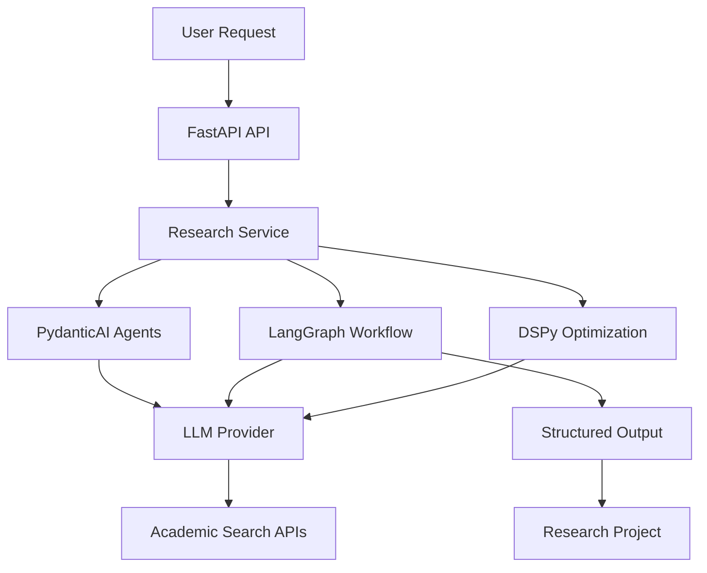

# AI Enablement Guide

This document provides a comprehensive overview of the AI components integrated into the AI Research Project Generator and how to use them effectively.

## 🤖 AI Architecture Overview

The AI Research Project Generator incorporates multiple AI frameworks to provide a comprehensive research generation system:



## 🧠 AI Components

### 1. PydanticAI Agents

**Location**: `src/ai_research_generator/agents/`

PydanticAI provides type-safe, structured output from LLMs with a FastAPI-like developer experience.

#### Available Agents

| Agent | Purpose | Input | Output |
|-------|---------|-------|--------|
| **TopicAnalyzerAgent** | Analyze research topics | TopicAnalysis model |
| **MethodologyAgent** | Recommend methodologies | MethodologyRecommendation model |
| **LiteratureSynthesizerAgent** | Synthesize literature findings | LiteratureSynthesis model |

#### Usage Example

```python
from ai_research_generator.agents import TopicAnalyzerAgent

# Initialize agent
agent = TopicAnalyzerAgent(
    model="llama3.1:8b",
    base_url="http://localhost:11434"
)

# Get structured analysis
result = await agent.run(
    topic="Machine learning in healthcare",
    discipline="computer science"
)

print(result.key_concepts)
print(result.complexity_level)
```

### 2. LangGraph Workflows

**Location**: `src/ai_research_generator/workflows/`

LangGraph provides stateful, multi-agent workflows with checkpointing and persistence.

#### Research Workflow Features

- **State Management**: Shared state across workflow nodes
- **Checkpointing**: Pause/resume long-running workflows
- **Error Recovery**: Automatic retry with exponential backoff
- **Parallel Processing**: Execute multiple nodes simultaneously

#### Workflow Nodes

1. **Topic Analysis**: Extract key concepts and scope
2. **Literature Search**: Find relevant academic papers
3. **Synthesis**: Combine findings from multiple sources
4. **Validation**: Check quality and compliance
5. **Generation**: Create final research project

#### Usage Example

```python
from ai_research_generator.workflows import create_research_graph

# Create workflow graph
graph = create_research_graph()

# Execute workflow
result = await graph.ainvoke({
    "topic": "Machine learning in healthcare",
    "research_question": "How effective is ML in medical diagnosis?",
    "research_type": "systematic_review",
    "paper_limit": 20
})

print(result.final_project)
```

### 3. DSPy Optimization

**Location**: `src/ai_research_generator/optimization/`

DSPy provides eval-driven optimization for improving prompt performance.

#### Optimization Modules

| Module | Purpose | Optimization Target |
|--------|---------|-------------------|
| **TopicAnalyzerModule** | Topic analysis accuracy | Few-shot examples |
| **PaperSynthesizerModule** | Literature synthesis quality | BootstrapFewShot |
| **MethodologyRecommenderModule** | Methodology recommendations | MIPROv2 |

#### Optimization Process

1. **Training Set**: Create examples of high-quality outputs
2. **Optimization**: Use DSPy optimizers to improve prompts
3. **Evaluation**: Measure performance on validation set
4. **Deployment**: Save optimized prompts for production

#### Usage Example

```python
from ai_research_generator.optimization import optimize_topic_analyzer

# Optimize topic analyzer
optimized_module = await optimize_topic_analyzer(
    training_examples=training_data,
    valset_examples=validation_data,
    optimizer="miprov2"
)

# Save for production
optimized_module.save("optimized_topic_analyzer.json")
```

## 🔧 Configuration

### Environment Variables

```bash
# LLM Configuration
LLM_PROVIDER=ollama
LLM_MODEL=llama3.1:8b
LLM_BASE_URL=http://localhost:11434
LLM_TEMPERATURE=0.7

# AI Component Configuration
ENABLE_PYDAIANT_AI=true
ENABLE_LANGGRAPH=true
ENABLE_DSPY=true

# Optimization Configuration
DSPY_CACHE_DIR=./cache/dspy
DSPY_OPTIMIZER=miprov2
```

### Settings Configuration

```python
from ai_research_generator.core import Settings

settings = Settings(
    # LLM Configuration
    llm_provider="ollama",
    llm_model="llama3.1:8b",
    llm_base_url="http://localhost:11434",
    
    # AI Components
    enable_pydantic_ai=True,
    enable_langgraph=True,
    enable_dspy=True,
    
    # Optimization
    dspy_cache_dir="./cache/dspy",
    dspy_optimizer="miprov2",
)
```

## 🚀 Integration Examples

### 1. Using AI Components in Services

```python
from ai_research_generator.services import ResearchService
from ai_research_generator.agents import TopicAnalyzerAgent
from ai_research_generator.workflows import create_research_graph

class EnhancedResearchService(ResearchService):
    def __init__(self, settings: Settings):
        super().__init__(settings)
        self.topic_analyzer = TopicAnalyzerAgent(
            model=settings.llm_model,
            base_url=settings.llm_base_url
        )
        self.research_graph = create_research_graph()
    
    async def analyze_with_ai(self, topic: str, discipline: str):
        """Use PydanticAI for structured topic analysis"""
        return await self.topic_analyzer.run(topic, discipline)
    
    async def generate_with_workflow(self, request: ResearchRequest):
        """Use LangGraph for complete research generation"""
        return await self.research_graph.ainvoke({
            "topic": request.topic,
            "research_question": request.research_question,
            "research_type": request.research_type,
            "discipline": request.discipline,
            "paper_limit": request.paper_limit
        })
```

### 2. Adding New AI Agents

```python
from pydantic_ai import Agent, RunContext
from pydantic import BaseModel, Field

class ResearchGapAnalysis(BaseModel):
    """Structured output for research gap analysis."""
    gaps: list[str] = Field(description="Identified research gaps")
    opportunities: list[str] = Field(description="Research opportunities")
    confidence_score: float = Field(description="Confidence in analysis")

@dataclass
class ResearchDependencies:
    llm_client: LLMClient

gap_analyzer = Agent(
    "openai:gpt-4",
    deps_type=ResearchDependencies,
    output_type=ResearchGapAnalysis,
    system_prompt="Analyze research literature to identify gaps and opportunities."
)

@gap_analyzer.tool
async def search_papers(ctx: RunContext[ResearchDependencies], query: str) -> str:
    """Search for relevant papers."""
    # Implementation here
    return "Search results..."

# Add to agents/__init__.py
__all__ = ["GapAnalyzerAgent"]
```

### 3. Creating Custom Workflows

```python
from langgraph.graph import StateGraph, START, END
from typing import TypedDict, Annotated
from operator import add

class CustomResearchState(TypedDict):
    topic: str
    literature: list[str]
    analysis: dict
    gaps: list[str]
    recommendations: list[str]

def analyze_gaps(state: CustomResearchState) -> CustomResearchState:
    """Node for analyzing research gaps"""
    # Use gap analyzer agent
    result = await gap_analyzer.run(state.topic, state.literature)
    return {"gaps": result.gaps, "opportunities": result.opportunities}

def generate_recommendations(state: CustomResearchState) -> CustomResearchState:
    """Node for generating recommendations"""
    # Implementation here
    return {"recommendations": recommendations}

# Build workflow
workflow = StateGraph(CustomResearchState)
workflow.add_node("analyze_gaps", analyze_gaps)
workflow.add_node("generate_recommendations", generate_recommendations)
workflow.add_edge(START, "analyze_gaps")
workflow.add_edge("analyze_gaps", "generate_recommendations")
workflow.add_edge("generate_recommendations", END)

graph = workflow.compile()
```

## 📊 Performance and Monitoring

### Observability

- **Logging**: All AI operations are logged with structured data
- **Metrics**: Track token usage, response times, and success rates
- **Tracing**: LangSmith integration for workflow tracing (when available)

### Performance Optimization

1. **Caching**: Cache LLM responses and optimization results
2. **Batching**: Process multiple requests in parallel when possible
3. **Model Selection**: Choose appropriate models for each task
4. **Prompt Optimization**: Use DSPy to improve prompt efficiency

## 🔍 Testing AI Components

### Unit Tests

```python
import pytest
from ai_research_generator.agents import TopicAnalyzerAgent

@pytest.mark.asyncio
async def test_topic_analyzer():
    agent = TopicAnalyzerAgent(model="test-model")
    result = await agent.run("AI in healthcare", "computer science")
    
    assert result.key_concepts
    assert result.complexity_level in ["basic", "intermediate", "advanced"]
    assert len(result.suggested_subtopics) > 0
```

### Integration Tests

```python
import pytest
from ai_research_generator.workflows import create_research_graph

@pytest.mark.asyncio
async def test_research_workflow():
    graph = create_research_graph()
    
    result = await graph.ainvoke({
        "topic": "Test topic",
        "research_question": "Test question?",
        "research_type": "systematic_review"
    })
    
    assert "final_project" in result
    assert result["errors"] == []
```

## 🚧 Troubleshooting

### Common Issues

1. **LLM Connection Errors**
   - Check if Ollama is running: `ollama serve`
   - Verify model availability: `ollama list`
   - Check network connectivity

2. **Workflow Failures**
   - Review LangGraph state transitions
   - Check for missing required state keys
   - Verify agent output schemas

3. **Optimization Issues**
   - Ensure training data quality
   - Check optimizer configuration
   - Monitor validation performance

### Debug Mode

Enable debug logging:

```python
import logging
from ai_research_generator.core import get_settings

logging.basicConfig(level=logging.DEBUG)
settings = get_settings()
settings.debug = True
```

## 📚 Further Reading

- [PydanticAI Documentation](https://ai.pydantic.dev/)
- [LangGraph Documentation](https://docs.langchain.com/langgraph)
- [DSPy Documentation](https://dspy-docs.vercel.app/)
- [FastAPI Documentation](https://fastapi.tiangolo.com/)

## 🤝 Contributing to AI Components

When contributing to AI components:

1. **Follow Type Safety**: Use Pydantic models for all structured output
2. **Add Tests**: Include unit and integration tests
3. **Document**: Update this guide with new components
4. **Optimize**: Consider performance implications
5. **Handle Errors**: Implement proper error handling and retry logic
