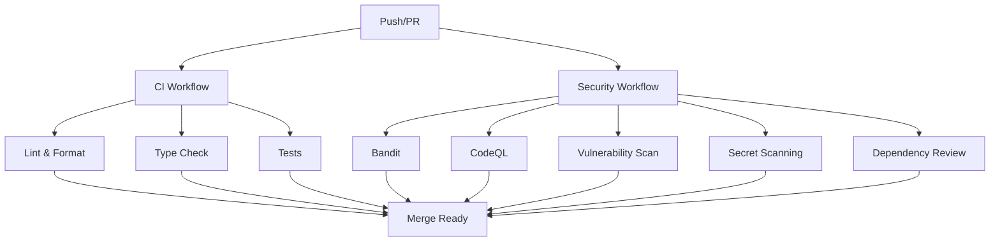

# CI/CD Troubleshooting Guide

This guide provides detailed troubleshooting steps for common CI/CD issues in the AI Research Project Generator.

## Table of Contents

- [Overview](#overview)
- [CI/CD Pipeline Structure](#cicd-pipeline-structure)
- [Common Failure Scenarios](#common-failure-scenarios)
- [Debugging Workflow](#debugging-workflow)
- [Local Testing](#local-testing)
- [GitHub Actions Specific Issues](#github-actions-specific-issues)
- [Performance Optimization](#performance-optimization)
- [Emergency Procedures](#emergency-procedures)

## Overview

The project uses GitHub Actions for CI/CD with multiple workflows:

- **ci.yml**: Code quality, testing, and type checking
- **security.yml**: Security scanning and vulnerability analysis
- **dspy-optimization.yml**: DSPy prompt optimization (manual)

All workflows must pass before code can be merged to the main branch.

## CI/CD Pipeline Structure

### Workflow Files

```
.github/workflows/
├── ci.yml                 # Main CI pipeline
├── security.yml           # Security scanning
└── dspy-optimization.yml  # DSPy optimization (manual)
```

### Required Checks

The following checks are required for PR merges:

1. **Code Quality**
   - Lint & Format Check (Ruff)
   - Type Check (MyPy)

2. **Testing**
   - Tests (Python 3.10, 3.11, 3.12)
   - Test coverage reporting

3. **Security**
   - Bandit Security Linter
   - CodeQL Analysis
   - Vulnerability Scan (pip-audit)
   - Secret Scanning
   - Dependency Review

### Workflow Dependencies



## Common Failure Scenarios

### 1. Import Errors

#### Symptoms
```
ModuleNotFoundError: No module named 'app'
ImportError: cannot import name 'X' from 'Y'
```

#### Common Causes
- Package restructuring changes
- Relative vs absolute import issues
- Missing __init__.py files
- Incorrect PYTHONPATH

#### Fixes

**Case 1: Package Restructuring**

```python
# ❌ Old structure
from app.core.config import Settings

# ✅ New structure  
from src.ai_research_generator.core.config import Settings
```

**Case 2: Relative Imports in Package**

```python
# ❌ Wrong relative import
from app.schemas.research import ResearchRequest

# ✅ Correct relative import
from ..models.schemas.research import ResearchRequest
```

**Case 3: Legacy Module Imports**

```python
# ❌ Old import
from llm_provider import LLMProvider

# ✅ New relative import
from .llm_provider import LLMProvider
```

#### Debug Steps

1. **Check import paths locally**:
```bash
uv run python -c "from src.ai_research_generator.api.main import app; print('✅ Import works')"
```

2. **Verify package structure**:
```bash
find src/ -name "__init__.py" | head -10
```

3. **Test with PYTHONPATH**:
```bash
PYTHONPATH=src uv run python -c "import ai_research_generator"
```

### 2. Test Failures

#### Symptoms
```
FAILED tests/test_api.py::TestHealthEndpoint::test_health_check
ERROR collecting tests/test_workflow.py
```

#### Common Causes
- Import errors in test files
- Missing test dependencies
- Test environment differences
- Async/await issues

#### Fixes

**Case 1: Test Import Issues**

```python
# ❌ Wrong import in test
from app.api.main import app

# ✅ Correct import
from src.ai_research_generator.api.main import app
```

**Case 2: Mock Path Issues**

```python
# ❌ Wrong patch path
with patch("app.workflows.agents.create_agent"):

# ✅ Correct patch path
with patch("src.ai_research_generator.workflows.agents.create_agent"):
```

**Case 3: Async Test Issues**

```python
# ❌ Missing async marker
def test_async_function():
    await some_async_function()

# ✅ Proper async test
@pytest.mark.asyncio
async def test_async_function():
    await some_async_function()
```

#### Debug Steps

1. **Run specific test locally**:
```bash
uv run pytest tests/test_api.py::TestHealthEndpoint::test_health_check -v
```

2. **Run with detailed output**:
```bash
uv run pytest tests/ -v --tb=long --capture=no
```

3. **Check test collection**:
```bash
uv run pytest tests/ --collect-only
```

### 3. Linting/Formatting Failures

#### Symptoms
```
Would reformat: src/ai_research_generator/api/main.py
E402 module level import not at top of file
F841 local variable 'x' is assigned to but never used
```

#### Common Causes
- Code formatting issues
- Import order problems
- Unused variables
- Line length violations

#### Fixes

**Case 1: Formatting Issues**

```bash
# Auto-fix formatting
uv run ruff format .

# Check what would be formatted
uv run ruff format --check .
```

**Case 2: Linting Issues**

```bash
# Auto-fix linting
uv run ruff check --fix .

# Check specific rules
uv run ruff check --select=E402,F841 .
```

**Case 3: Import Order**

```python
# ❌ Wrong order
from typing import Dict
import os
from mymodule import func

# ✅ Correct order
import os
from typing import Dict

from mymodule import func
```

#### Debug Steps

1. **Check specific file**:
```bash
uv run ruff check src/ai_research_generator/api/main.py
uv run ruff format --check src/ai_research_generator/api/main.py
```

2. **Check configuration**:
```bash
uv run ruff check --show-settings
```

### 4. Security Scanner Failures

#### Symptoms
```
Bandit: [B104] hardcoded_bind_all_interfaces
Bandit: [B311] standard pseudo-random generators
CodeQL: 20 potential problems found
```

#### Common Causes
- Security vulnerabilities
- Hardcoded secrets
- Unsafe function usage
- XML parsing issues

#### Fixes

**Case 1: Bandit Issues**

```python
# ❌ Hardcoded bind to all interfaces
uvicorn.run("app.main:app", host="0.0.0.0")

# ✅ Bind to localhost
uvicorn.run("app.main:app", host="127.0.0.1")

# ❌ Random for security
import random
token = random.randint(1000, 9999)

# ✅ Use secrets or nosec comment
import secrets
token = secrets.randbelow(9000) + 1000
# OR
import random
jitter = random.uniform(0, 0.25)  # nosec: B311 - Non-security use
```

**Case 2: CodeQL Issues**

CodeQL issues are typically more complex and require understanding the specific security concern.

#### Debug Steps

1. **Run Bandit locally**:
```bash
uv run bandit -r src/ -c pyproject.toml -f json -o bandit-report.json
cat bandit-report.json | jq '.results[] | {file: .filename, issue: .issue_text, severity: .issue_severity}'
```

2. **Check Bandit configuration**:
```bash
uv run bandit -r src/ -c pyproject.toml --verbose
```

### 5. Dependency Issues

#### Symptoms
```
ERROR: Could not install packages due to an EnvironmentError
pip-audit: Found 2 known vulnerabilities
```

#### Common Causes
- Dependency conflicts
- Vulnerable dependencies
- Missing dependencies
- Version constraints

#### Fixes

**Case 1: Dependency Conflicts**

```bash
# Clean reinstall
rm -rf .venv
uv sync

# Check for conflicts
uv pip check
```

**Case 2: Vulnerable Dependencies**

```bash
# Update vulnerable packages
uv pip install --upgrade urllib3 requests

# Or add version constraints
# In pyproject.toml:
[project]
dependencies = [
    "urllib3>=1.26.6",  # Secure version
]
```

#### Debug Steps

1. **Check dependency tree**:
```bash
uv pip list
uv pip show package-name
```

2. **Run security audit**:
```bash
uv run pip-audit --format json --output audit-report.json
```

### 6. Build/Environment Issues

#### Symptoms
```
No such file or directory: 'uv'
Python: command not found
ModuleNotFoundError: No module named 'pytest'
```

#### Common Causes
- Missing tools
- Python version mismatch
- Environment setup issues
- Cache corruption

#### Fixes

**Case 1: Missing uv**

```bash
# Install uv
curl -LsSf https://astral.sh/uv/install.sh | sh

# Or use pip
pip install uv
```

**Case 2: Python Version**

```bash
# Check Python version
python --version
python3 --version

# Set correct version in pyproject.toml
[project]
requires-python = ">=3.9"
```

**Case 3: Cache Issues**

```bash
# Clear caches
rm -rf .venv
rm -rf .pytest_cache
rm -rf .mypy_cache

# Reinstall
uv sync
```

#### Debug Steps

1. **Check environment**:
```bash
which python
which uv
python --version
uv --version
```

2. **Test basic imports**:
```bash
uv run python -c "import sys; print(sys.path)"
```

## Debugging Workflow

### Step 1: Identify the Failure

```bash
# Get PR status
gh pr checks <PR_NUMBER>

# Get specific workflow details
gh run view <RUN_ID>

# Get workflow logs
gh run view <RUN_ID> --log
```

### Step 2: Reproduce Locally

```bash
# Clone the failing commit
git checkout <COMMIT_SHA>

# Run the same checks as CI
uv run ruff check .
uv run ruff format --check .
uv run mypy .
uv run pytest tests/
uv run bandit -r src/ -c pyproject.toml
uv run pip-audit
```

### Step 3: Isolate the Issue

```bash
# Run specific failing test
uv run pytest tests/test_failing.py::test_name -v --tb=long

# Run specific linting check
uv run ruff check src/failing_file.py

# Check specific security issue
uv run bandit -r src/filing_file.py -c pyproject.toml
```

### Step 4: Fix and Verify

```bash
# Apply fix
# ... make changes ...

# Verify fix locally
uv run pytest tests/test_failing.py::test_name -v

# Run full test suite
uv run pytest tests/
```

### Step 5: Commit and Test

```bash
git add .
git commit -m "fix: resolve CI issue - description"
git push origin feature/branch-name

# Monitor CI
gh run list --branch=feature/branch-name --limit=1
```

## Local Testing

### Environment Setup

```bash
# Ensure clean environment
rm -rf .venv
uv sync

# Verify setup
uv run python -c "import sys; print('Python:', sys.version)"
uv run pytest --version
uv run ruff --version
```

### Running CI Commands Locally

```bash
# Exact CI commands
uv run ruff check .
uv run ruff format --check .
uv run mypy .
uv run pytest tests/ --cov=src --cov-report=xml
uv run bandit -r src/ -c pyproject.toml
uv run pip-audit
```

### Testing with Different Python Versions

```bash
# Test with Python 3.10
uv run --python 3.10 pytest tests/

# Test with Python 3.11  
uv run --python 3.11 pytest tests/

# Test with Python 3.12
uv run --python 3.12 pytest tests/
```

### Performance Testing

```bash
# Time the test suite
time uv run pytest tests/

# Profile slow tests
uv run pytest tests/ --durations=10

# Run with coverage
uv run pytest tests/ --cov=src --cov-report=term-missing
```

## GitHub Actions Specific Issues

### Workflow Timeout

#### Symptoms
```
Error: The operation was canceled.
Job exceeded maximum timeout.
```

#### Fixes

1. **Increase timeout in workflow**:
```yaml
jobs:
  test:
    timeout-minutes: 30  # Increase from default 10
```

2. **Optimize test performance**:
```bash
# Run tests in parallel
uv run pytest tests/ -n auto

# Skip slow tests
uv run pytest tests/ -m "not slow"
```

### Cache Issues

#### Symptoms
```
Error: Cache not found for input keys
Failed to save cache
```

#### Fixes

1. **Clear cache manually**:
```bash
gh api repos/:owner/:repo/actions/caches --jq '.actions_caches[].id' | xargs -I {} gh api --method DELETE repos/:owner/:repo/actions/caches/{}
```

2. **Update cache keys**:
```yaml
- name: Cache dependencies
  uses: actions/cache@v3
  with:
    key: ${{ runner.os }}-uv-${{ hashFiles('**/pyproject.toml') }}
    restore-keys: |
      ${{ runner.os }}-uv-
```

### Permission Issues

#### Symptoms
```
Error: Permission denied
Resource not accessible by integration
```

#### Fixes

1. **Check workflow permissions**:
```yaml
permissions:
  contents: read
  checks: write
  pull-requests: write
```

2. **Update repository settings**:
- Go to repository Settings → Actions → General
- Enable "Allow GitHub Actions to create and approve pull requests"

### Resource Limits

#### Symptoms
```
Error: Runner out of memory
Error: Disk space exhausted
```

#### Fixes

1. **Use larger runner**:
```yaml
runs-on: ubuntu-latest-4-cores  # More resources
```

2. **Optimize resource usage**:
```yaml
- name: Clean up
  run: |
    rm -rf ~/.cache
    docker system prune -f
```

## Performance Optimization

### Test Optimization

```bash
# Run tests in parallel
uv run pytest tests/ -n auto

# Use test splitting
uv run pytest tests/ --dist=loadscope

# Skip integration tests in CI
uv run pytest tests/ -m "unit" --ignore=tests/integration/
```

### Dependency Optimization

```bash
# Use minimal dependencies for testing
uv sync --group test

# Pre-install common packages
uv pip install pytest pytest-cov pytest-asyncio
```

### Cache Optimization

```yaml
# In .github/workflows/ci.yml
- name: Cache uv
  uses: actions/cache@v3
  with:
    path: ~/.cache/uv
    key: ${{ runner.os }}-uv-${{ hashFiles('**/pyproject.toml') }}
    restore-keys: |
      ${{ runner.os }}-uv-
```

## Emergency Procedures

### Rollback Failed Changes

```bash
# Identify last good commit
git log --oneline -10

# Reset to last good commit
git reset --hard <GOOD_COMMIT_SHA>

# Force push (use with caution)
git push --force-with-lease origin feature/branch-name
```

### Bypass Required Checks (Emergency Only)

```bash
# Add bypass comment to PR
# !bypass-checks - Emergency fix for production issue

# Or use GitHub CLI
gh pr merge <PR_NUMBER> --merge --admin
```

### Manual Workflow Trigger

```bash
# Trigger specific workflow manually
gh workflow run ci.yml --field branch=feature/branch-name

# Trigger with parameters
gh workflow run security.yml --field branch=main
```

### Contact Information

For urgent CI/CD issues:

1. **GitHub Status**: Check [GitHub Status](https://www.githubstatus.com/)
2. **Actions Status**: Check [GitHub Actions Status](https://www.githubstatus.com/incidents)
3. **Repository Maintainers**: Contact via GitHub discussions or issues

### Monitoring and Alerting

```bash
# Monitor workflow runs
gh run list --limit=10 --status=failure

# Set up notifications (GitHub webhooks or third-party tools)
# Consider tools like:
# - GitHub Actions notifications
# - Slack integration
# - Email alerts
```

## Additional Resources

- [GitHub Actions Documentation](https://docs.github.com/en/actions)
- [Ruff Documentation](https://docs.astral.sh/ruff/)
- [Bandit Documentation](https://bandit.readthedocs.io/)
- [pytest Documentation](https://docs.pytest.org/)
- [uv Documentation](https://docs.astral.sh/uv/)

## Getting Help

If you encounter issues not covered in this guide:

1. **Check existing issues**: [GitHub Issues](https://github.com/devin-patterson/ai-research-project-generator/issues)
2. **Create detailed issue**: Include logs, reproduction steps, and environment info
3. **Ask in discussions**: [GitHub Discussions](https://github.com/devin-patterson/ai-research-project-generator/discussions)
4. **Contact maintainers**: Via GitHub @ mentions or repository contact info

---

*Last updated: 2026-01-31*
